# 🧭 CampusNav — CUTM Paralakhemundi
### Autonomous Multi-Sensor GPS-Free Indoor Campus Navigation Platform
**Centurion University of Technology and Management (CUTM), Paralakhemundi Campus**

[](https://aryanakshat7277.github.io/campus-nav/)
[](https://angular.io/)
[](https://spring.io/projects/spring-boot)
[](https://www.java.com/)
[](https://leafletjs.com/)
[](https://aryanakshat7277.github.io/campus-nav/)

---

## 🌐 Live Working Application

Experience the live application globally without installing anything:
### 🔗 **[https://aryanakshat7277.github.io/campus-nav/](https://aryanakshat7277.github.io/campus-nav/)**

- **Operations Dashboard**: `https://aryanakshat7277.github.io/campus-nav/#/dashboard`
- **Indoor CAD Navigation**: `https://aryanakshat7277.github.io/campus-nav/#/navigate`
- **Signal Diagnostics Radar**: `https://aryanakshat7277.github.io/campus-nav/#/admin/diagnostics`
- **Optical QR Checkpoint Scanner**: `https://aryanakshat7277.github.io/campus-nav/#/qr-scanner`
- **Emergency Evacuation Hub**: `https://aryanakshat7277.github.io/campus-nav/#/emergency`

---

## 🏛️ Project Overview

**CampusNav** is an enterprise-grade smart navigation ecosystem specifically engineered for the 120-acre **Centurion University of Technology and Management (CUTM) Paralakhemundi** campus. 

Unlike traditional navigation systems that fail inside concrete academic buildings due to satellite signal attenuation, CampusNav operates **100% GPS-free** indoors using simulated:
1. **Wi-Fi 802.11mc Fine Timing Measurement (RTT)** — sub-meter trilateration with access points AP-001 through AP-006.
2. **Wi-Fi RSSI Signal Propagation** — log-distance path loss model with multi-floor wall attenuation penalties.
3. **Smartphone IMU Sensors** — tri-axial accelerometer step cadence, gyroscope angular rate, and compass heading.
4. **Physical Optical QR Checkpoints** — instant 100% position recalibration against millimeter-anchored wall plaques.
5. **Multi-Sensor Kalman Fusion Engine** — dynamic confidence weighting (High `CONFIRMED` ≥85%, Medium `ESTIMATED` 50–84%, Low `UNCERTAIN` <50%).
6. **Architectural CAD Indoor Blueprint Engine** — 3-floor vector CAD floorplans with 2.5D isometric view toggle, interactive elevator dispatch sequence, and dynamic route glow.

---

## 🌟 Key Features & Navigation Modules

| Module | Route | Description |
|---|---|---|
| **Campus Operations Dashboard** | `/dashboard` | Command launchpad connecting all 14 features, live telemetry pills, 4 infrastructure metrics, and walk simulation controls. |
| **Interactive 2D Campus Map** | `/` | Full geospatial grounds overview with building footprints, turf lawns, arterial roads, category filters, and route planner. |
| **GPS-Free Indoor CAD Navigation** | `/navigate` | 3-floor Aryabhatta Block blueprints with 2D/2.5D Isometric switch, compass flashlight cone, elevator sequence, and arrival celebration. |
| **Optical QR Checkpoint Scanner** | `/qr-scanner` | Holographic reticle HUD viewfinder with simulated camera stream, laser sweep, and cryptographic token snap recalibration. |
| **Hardware Signal Diagnostics** | `/admin/diagnostics` | 360° revolving RTT Radar PPI scope, 6-AP signal strength bars, 3D IMU gimbal, Kalman stream, and 5 scenario presets. |
| **Emergency Evacuation Hub** | `/emergency` | 1-touch high-priority evacuation routing to nearest Medical Center, Security Office, Fire Exits, and Assembly Points. |
| **Nearby Facilities Sorter** | `/nearby` | Real-time distance sorter for washrooms, cafeterias, ATMs, drinking water, and health clinics from current indoor coordinates. |
| **Guided Campus Visitor Tour** | `/visitor` | Curated 35-minute pedestrian itinerary covering Central Library, Campus Temple, Auditoriums, and Admin Blocks. |
| **Mobility & Route Preferences** | `/route-options` | Custom routing algorithms: Fastest, Shortest, Wheelchair-Accessible (elevators/ramps only), and Avoid Stairs. |
| **BLE Beacons Registry** | `/admin/beacons` | Telemetry inventory for the 6 Bluetooth Low Energy transmitters installed across Aryabhatta Block. |
| **QR Checkpoint Registry** | `/admin/qr` | Millimeter wall token management console with high-contrast printable badge previews. |
| **Campus CAD Building Directory** | `/admin/buildings` | Multi-floor structural registry with blueprint elevations, room allocations, and elevator flags. |
| **Wayfinding Landmarks Directory** | `/admin/landmarks` | Natural language landmark anchors ("Turn right past Central Library foyer") used for pedestrian instructions. |
| **Route Closures & Obstacles** | `/admin/closures` | Real-time maintenance blockage manager with instant dynamic A* detour recalculation. |
| **Master Locations Database** | `/admin` | Master administrative console for all 56 campus locations, operating hours, and campus bulletin announcements. |

---

## 🏗️ Technical Architecture

```mermaid
graph TD
    subgraph "Client Layer (Angular 17 Standalone)"
        Dash["Campus Operations Dashboard (/dashboard)"]
        Map2D["Leaflet 2D Geospatial Map (/)"]
        CAD["Architectural Indoor CAD Engine (/navigate)"]
        HUD["Signal Diagnostics & 360° Radar (/admin/diagnostics)"]
        QR["Optical QR Checkpoint Scanner (/qr-scanner)"]
    end

    subgraph "Core Simulation & Positioning Engines"
        Engine["IndoorPositionEngine (Multi-Sensor Kalman Fusion)"]
        Sensors["SensorSimulationService (Acc + Gyro + Compass)"]
        WifiRTT["WifiSimulationService (Log-Distance RSSI + RTT Ranging)"]
        Demo["DemoSimulationService (Preconfigured Walking Scenarios)"]
    end

    subgraph "Data & Pathfinding Services"
        AStar["A* Graph Pathfinding (Normal vs Wheelchair-Accessible)"]
        Voice["VoiceService (Web Speech Synthesis Turn Directions)"]
        MapSvc["MapService & LocationService (56 Geocoded POIs)"]
    end

    subgraph "Spring Boot Backend (REST API on :8080)"
        Boot["Spring Boot 3.2.4 + Java 17 + Spring Data JPA"]
        H2["H2 Database (Aryabhatta 3-Level CAD + 56 Locations)"]
    end

    WifiRTT --> Engine
    Sensors --> Engine
    QR -->|100% Snap| Engine
    Demo --> Engine

    Engine --> CAD
    Engine --> HUD
    Engine --> Dash

    AStar --> CAD
    AStar --> Map2D
    Voice --> CAD

    Boot --> H2
    Boot -.->|REST APIs| MapSvc
    Boot -.->|REST APIs| AStar
```



---

## 🎨 Design System: Institutional Light Mode

The user interface adheres to a strict, elegant academic design system:
- **Canvas / Background**: `#F8FAFC` clean cool slate
- **Surface / Cards**: `#FFFFFF` pure white cards with `#E2E8F0` borders and soft drop-shadows
- **Primary Institutional Blue**: `#1565C0` (Centurion Blue)
- **Secondary Campus Teal**: `#00897B` (Swaminathan Green/Teal)
- **Typography**: `#0F172A` / `#1A1A2E` dark slate for high readability
- **Strictly No Generic AI Theme**: Avoids dark cyberpunk neon gradients, glowing cyan cards, and robotic chatbot tropes in favor of an authentic academic campus portal.

---

## 🚀 Local Development Setup

### Prerequisites
- **Java 17+** (OpenJDK or Oracle JDK)
- **Maven 3.8+**
- **Node.js 18+** & **npm 9+**

### 1. Clone Repository
```bash
git clone https://github.com/aryanakshat7277/campus-nav.git
cd campus-nav
```

### 2. Launch Spring Boot Backend
```bash
cd backend
mvn spring-boot:run
```
*Backend runs on `http://localhost:8080` with H2 console at `/h2-console`.*

### 3. Launch Angular Frontend
```bash
cd ../frontend
npm install
npm start
```
*Frontend runs on `http://localhost:4200` with hot-reloading.*

---

## 📡 REST API Reference

| Method | Endpoint | Description |
|---|---|---|
| `GET` | `/api/locations` | List all 56 campus locations (supports `?category=`) |
| `GET` | `/api/buildings` | List campus buildings and structural dimensions |
| `GET` | `/api/beacons` | List BLE beacons (supports `?buildingId=` and `?floorId=`) |
| `GET` | `/api/qr` | List active optical QR checkpoints |
| `POST`| `/api/qr/resolve` | Resolve QR token coordinates for millimeter recalibration |
| `GET` | `/api/landmarks` | List pedestrian wayfinding landmark anchors |
| `GET` | `/api/navigation/indoor/nodes` | List Aryabhatta Block CAD nodes (GF, 1F, 2F) |
| `GET` | `/api/navigation/indoor/edges` | List walkable hallway, elevator, and stair connections |
| `POST`| `/api/navigation/indoor/route` | Compute indoor route with accessibility filtering |
| `GET` | `/api/navigation/indoor/closures`| List active corridor maintenance closures |

---

## 🏫 Centurion University of Technology and Management (CUTM)
**Paralakhemundi, Gajapati, Odisha 761211, India**
- **Campus Size**: 120 Acres
- **Key Blocks**: Aryabhatta Academic Block, M.S. Swaminathan School of Agriculture, School of Fisheries, Central Library, Indravati & Mahanadi Halls of Residence, Sports Complex, Campus Temple.

---

## 📄 License
Developed for CUTM Campus Navigation & Operations. All rights reserved.
